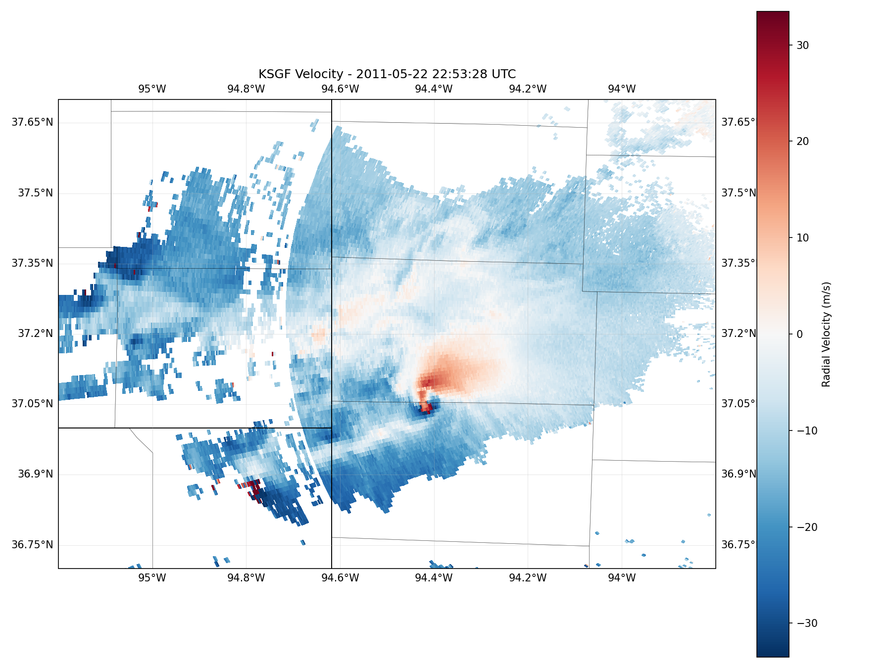

# Tornado Tracer
**Work in Progress**

**Author:** Joseph Cheatham
**Last Update:** 5/10/2026
**Version:** 0.1.0

An open source tornado path detection tool for first responders, built on NOAA NEXRAD Doppler radar data.
Tornado Tracer is being developed to ingest real-time and historical Level II radar scans, detect tornadic
rotation signatures algorithmically, and provide actionable path prediction output for emergency response use.

---

## Output Example


*KSGF radar radial velocity field showing the Joplin EF5 mesocyclone rotation signature, May 22 2011 22:53 UTC. The tight red/blue couplet near 94.4°W, 37.05°N indicates strong counter-clockwise rotation — the tornadic vortex actively moving through Joplin, MO.*

---

## Setup

```bash
pip install nexradaws arm-pyart cartopy matplotlib numpy pytz
```

## Usage

```bash
python joplin_2011.py
```

Downloads and plots radial velocity scans from the May 22, 2011 Joplin tornado event. Output PNGs are saved to the `plots/` directory.

---

## Current Progress
- Download NEXRAD Level II scans from NOAA's public AWS S3 archive
- Ingest and parse radar sweeps using Py-ART
- Plot georeferenced radial velocity fields with county/state overlays
- Validated against the May 22, 2011 Joplin, MO EF5 tornado (KSGF radar)

## Future Work
- Refactor script components into callable functions (download scans, process sweep, plot, etc.)
- Implement Tornadic Vortex Signature (TVS) based detection algorithm
- Path prediction from couplet motion vectors across successive scans
- User interface for first responder deployment

---

## Data Source
NEXRAD Level II data is publicly available via NOAA's AWS archive — no API key required.
```
s3://noaa-nexrad-level2/YYYY/MM/DD/{SITE}/{filename}
```
